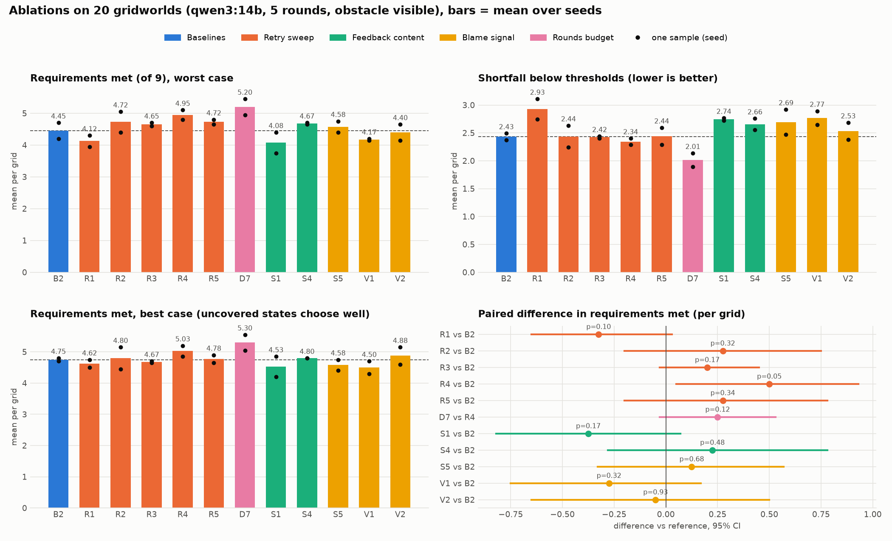
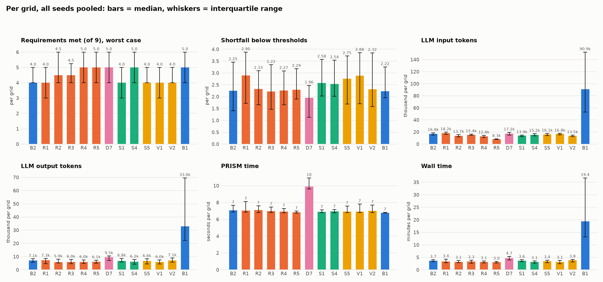
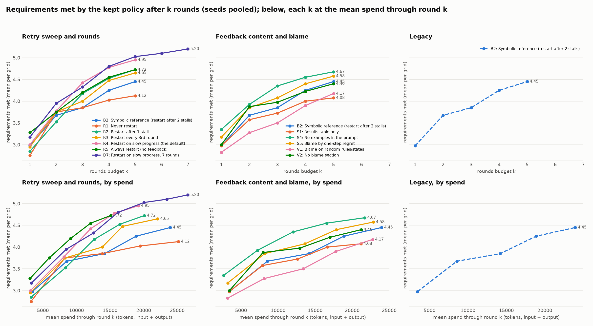
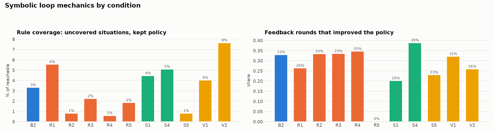
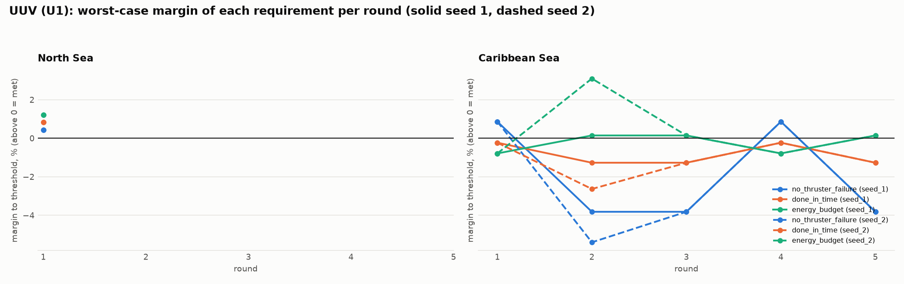

# Ablation results (auto-generated 2026-10-08 04:25)

Gridworld, 20 grids (19 solvable), qwen3:14b, 5 rounds, obstacle phase visible to rules and legacy. Symbolic numbers are worst case. Paired tests compare per-grid means (seeds averaged) against the reference with a sign-flip permutation test. These tests are exploratory: there are many of them and no correction for multiple comparisons, so a single p near 0.05 is what chance alone would give.

Regenerate: `python viz/ablation_summary.py configs/plot/ablation_summary.yaml`.

**Pending runs:** B1/seed_1

## Overview

## Distributions and costs (medians, interquartile range)

## Budget curves

## Loop mechanics (symbolic)

## Outcomes (per grid, seeds pooled)

| cond | change | seeds | solved (of solvable) | req. met: mean (seed range) | median [IQR] | best case | shortfall: median [IQR] | uncovered % | vs | Δ met [95% CI] | p | feedback rounds improved |
|---|---|---|---|---|---|---|---|---|---|---|---|---|
| B2 | Symbolic reference (restart after 2 stalls) | 2 | 0/19 | 4.45 (4.20 to 4.70) | 4 [4 to 5] | 4.75 | 2.25 [1.40 to 3.46] | 3 |  |  |  | 33% |
| R1 | Never restart | 2 | 0/19 | 4.12 (3.95 to 4.30) | 4 [3 to 5] | 4.62 | 2.90 [1.72 to 3.88] | 6 | B2 | -0.33 [-0.65, +0.03] | 0.102 | 26% |
| R2 | Restart after 1 stall | 2 | 0/19 | 4.72 (4.40 to 5.05) | 4 [4 to 6] | 4.80 | 2.33 [1.66 to 3.09] | 1 | B2 | +0.28 [-0.20, +0.75] | 0.319 | 33% |
| R3 | Restart every 3rd round | 2 | 0/19 | 4.65 (4.60 to 4.70) | 4 [4 to 5] | 4.67 | 2.22 [1.47 to 3.35] | 2 | B2 | +0.20 [-0.03, +0.45] | 0.172 | 33% |
| R4 | Restart on slow progress (the default) | 2 | 0/19 | 4.95 (4.80 to 5.10) | 5 [4 to 6] | 5.03 | 2.27 [1.66 to 3.09] | 1 | B2 | +0.50 [+0.05, +0.93] | 0.055 | 35% |
| R5 | Always restart (no feedback) | 2 | 0/19 | 4.72 (4.65 to 4.80) | 5 [4 to 6] | 4.78 | 2.29 [1.90 to 3.18] | 2 | B2 | +0.28 [-0.20, +0.78] | 0.342 |  |
| D7 | Restart on slow progress, 7 rounds | 2 | 0/19 | 5.20 (4.95 to 5.45) | 5 [4 to 6] | 5.30 | 1.96 [1.13 to 2.48] | 1 | R4 | +0.25 [-0.03, +0.53] | 0.123 | 35% |
| S1 | Results table only | 2 | 0/19 | 4.08 (3.75 to 4.40) | 4 [3 to 5] | 4.53 | 2.58 [2.03 to 3.57] | 4 | B2 | -0.38 [-0.82, +0.07] | 0.171 | 20% |
| S4 | No examples in the prompt | 2 | 0/19 | 4.67 (4.65 to 4.70) | 5 [4 to 6] | 4.80 | 2.54 [2.02 to 3.54] | 5 | B2 | +0.23 [-0.28, +0.78] | 0.479 | 39% |
| S5 | Blame by one-step regret | 2 | 0/19 | 4.58 (4.40 to 4.75) | 4 [4 to 5] | 4.58 | 2.75 [1.69 to 3.71] | 1 | B2 | +0.12 [-0.33, +0.57] | 0.683 | 23% |
| V1 | Blame on random rules/states | 2 | 0/19 | 4.17 (4.15 to 4.20) | 4 [3 to 5] | 4.50 | 2.88 [1.70 to 3.86] | 4 | B2 | -0.28 [-0.75, +0.17] | 0.319 | 32% |
| V2 | No blame section | 2 | 0/19 | 4.40 (4.15 to 4.65) | 4 [4 to 5] | 4.88 | 2.32 [1.59 to 3.85] | 8 | B2 | -0.05 [-0.65, +0.50] | 0.931 | 26% |

## Costs (mean per grid)

| cond | input tokens | output tokens | PRISM time (s) | wall time (min) | spend (tokens, input + output) |
|---|---|---|---|---|---|
| B2 | 17.0k | 7.0k | 9 | 3.7 | 23,969 |
| R1 | 18.3k | 6.8k | 8 | 3.6 | 25,176 |
| R2 | 13.7k | 6.4k | 10 | 3.3 | 20,102 |
| R3 | 15.8k | 6.3k | 10 | 3.4 | 22,084 |
| R4 | 13.0k | 6.2k | 9 | 3.2 | 19,219 |
| R5 | 8.8k | 6.2k | 7 | 3.1 | 15,081 |
| D7 | 17.5k | 9.1k | 14 | 4.7 | 26,580 |
| S1 | 14.0k | 7.2k | 7 | 3.6 | 21,172 |
| S4 | 15.7k | 6.0k | 7 | 3.1 | 21,691 |
| S5 | 16.2k | 6.7k | 8 | 3.4 | 22,856 |
| V1 | 16.7k | 6.1k | 8 | 3.1 | 22,743 |
| V2 | 14.0k | 7.2k | 7 | 3.7 | 21,210 |

## Requirements met after k rounds

| cond | k=1 | k=2 | k=3 | k=4 | k=5 | k=6 | k=7 |
|---|---|---|---|---|---|---|---|
| B2 | 2.98 | 3.67 | 3.85 | 4.25 | 4.45 |  |  |
| R1 | 2.75 | 3.75 | 3.85 | 4.03 | 4.12 |  |  |
| R2 | 2.85 | 3.52 | 4.17 | 4.53 | 4.72 |  |  |
| R3 | 2.95 | 3.75 | 4.00 | 4.47 | 4.65 |  |  |
| R4 | 3.00 | 3.77 | 4.42 | 4.78 | 4.95 |  |  |
| R5 | 3.27 | 3.75 | 4.20 | 4.55 | 4.72 |  |  |
| D7 | 3.17 | 3.95 | 4.33 | 4.80 | 5.03 | 5.10 | 5.20 |
| S1 | 2.98 | 3.58 | 3.73 | 4.00 | 4.08 |  |  |
| S4 | 3.35 | 3.92 | 4.35 | 4.55 | 4.67 |  |  |
| S5 | 3.17 | 3.85 | 4.08 | 4.40 | 4.58 |  |  |
| V1 | 2.83 | 3.27 | 3.50 | 3.90 | 4.17 |  |  |
| V2 | 3.00 | 3.88 | 3.98 | 4.22 | 4.40 |  |  |

## UUV (U1: the symbolic reference on the paper's two scenarios, with the energy budget)

| seed | scenario | solved (worst case) | rounds | rules | tokens in / out | final worst-case values |
|---|---|---|---|---|---|---|
| seed_1 | North Sea | True | 1 | 25 | 2.1k / 0.8k | no_thruster_failure 0.673, done_in_time 0.807, energy_budget 26.182 |
| seed_1 | Caribbean Sea | False | 5 | 25 | 16.3k / 3.5k | no_thruster_failure 0.348, done_in_time 0.860, energy_budget 62.992 |
| seed_2 | North Sea | True | 1 | 25 | 2.1k / 0.8k | no_thruster_failure 0.673, done_in_time 0.807, energy_budget 26.182 |
| seed_2 | Caribbean Sea | False | 5 | 25 | 16.3k / 3.8k | no_thruster_failure 0.348, done_in_time 0.860, energy_budget 62.992 |

