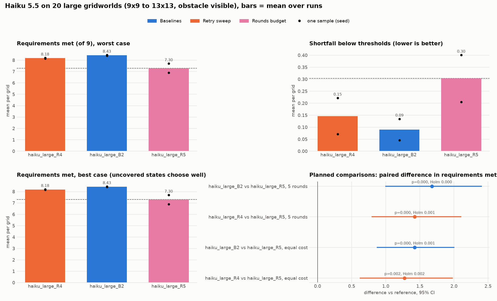
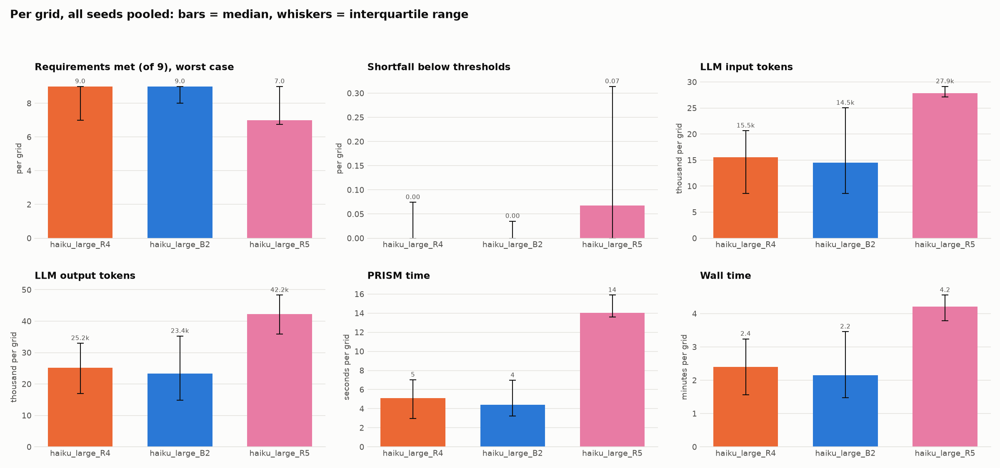
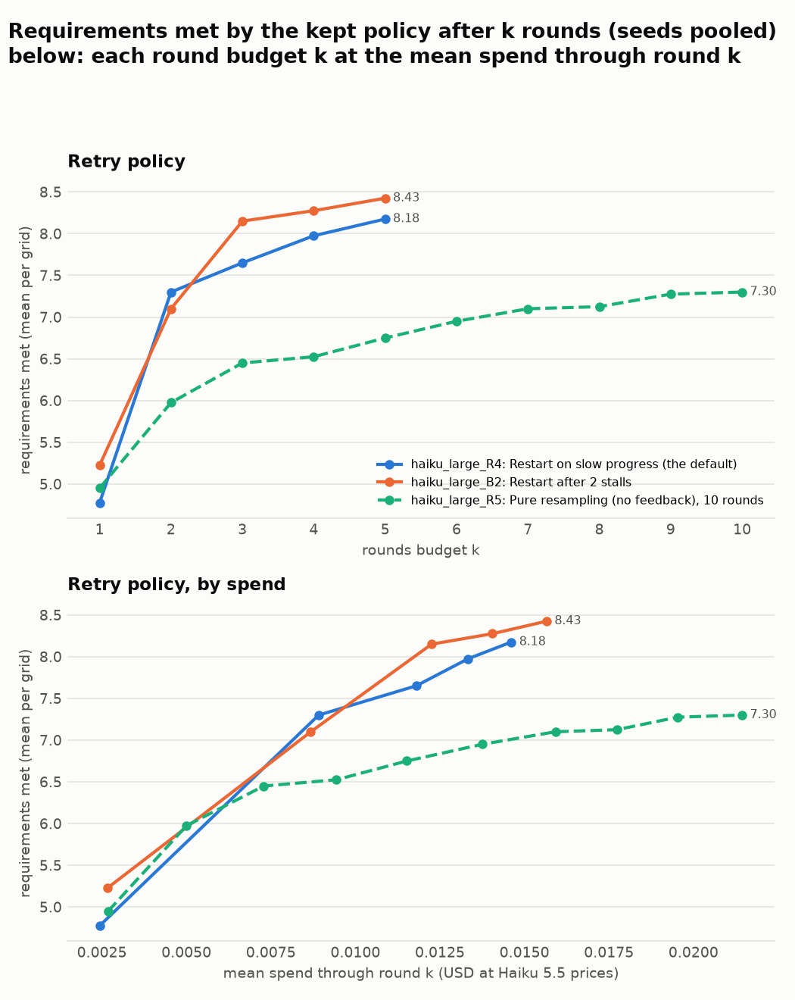
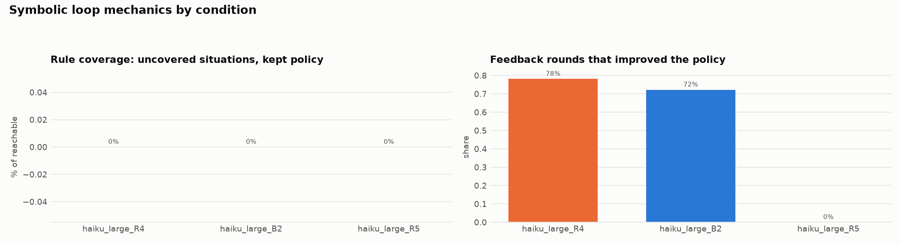

# Haiku ablation on grid_20_large (auto-generated 2026-10-08 07:39)

Gridworld, 20 grids of sizes 9 to 13 (20 solvable), anthropic/claude-haiku-5.5, thinking on, obstacle phase visible to the rules. Two unseeded runs per condition on OpenRouter, Anthropic's endpoint (no Claude endpoint accepts a seed). Symbolic numbers are worst case; the main table reports the exact check's values, the budget curves and planned comparisons the loop's (replayed per round). The main table is each condition's full budget: 5 rounds, or 10 for pure resampling.

Regenerate: `python viz/ablation_summary.py configs/plot/haiku_large.yaml`.

## Planned comparisons

Fixed before the runs. Requirements met by the kept policy (worst case, the loop's values), per grid averaged over runs; paired sign-flip test over the grids. p (Holm) corrects for all 4 comparisons together; below 0.05 counts. "equal cost": the condition's whole run against the reference given, on each grid, the condition's mean spend there (USD at Haiku 5.5 prices).

| comparison | at | grids | Δ met [95% CI] | p | p (Holm) |
|---|---|---|---|---|---|
| haiku_large_B2 vs haiku_large_R5 | 5 rounds | 20 | +1.68 [+1.00, +2.40] | 0.000 | 0.000 |
| haiku_large_R4 vs haiku_large_R5 | 5 rounds | 20 | +1.43 [+0.80, +2.10] | 0.000 | 0.001 |
| haiku_large_B2 vs haiku_large_R5 | equal cost | 20 | +1.43 [+0.88, +2.00] | 0.000 | 0.001 |
| haiku_large_R4 vs haiku_large_R5 | equal cost | 20 | +1.27 [+0.62, +1.98] | 0.002 | 0.002 |

## Overview

## Distributions and costs (medians, interquartile range)

## Budget curves

## Loop mechanics (symbolic)

## Outcomes (per grid, seeds pooled)

| cond | change | seeds | solved (of solvable) | req. met: mean (seed range) | median [IQR] | best case | shortfall: median [IQR] | uncovered % | vs | Δ met [95% CI] | p | feedback rounds improved |
|---|---|---|---|---|---|---|---|---|---|---|---|---|
| haiku_large_R4 | Restart on slow progress (the default) | 2 | 12/20 | 8.18 (8.15 to 8.20) | 9 [7 to 9] | 8.18 | 0.00 [0.00 to 0.07] | 0 |  |  |  | 78% |
| haiku_large_B2 | Restart after 2 stalls | 2 | 14/20 | 8.43 (8.40 to 8.45) | 9 [8 to 9] | 8.43 | 0.00 [0.00 to 0.04] | 0 |  |  |  | 72% |
| haiku_large_R5 | Pure resampling (no feedback), 10 rounds | 2 | 5.5/20 | 7.30 (6.90 to 7.70) | 7 [7 to 9] | 7.30 | 0.07 [0.00 to 0.31] | 0 |  |  |  |  |

## Costs (mean per grid)

| cond | input tokens | output tokens | PRISM time (s) | wall time (min) | spend (USD at Haiku 5.5 prices) |
|---|---|---|---|---|---|
| haiku_large_R4 | 16.3k | 26.0k | 8 | 2.8 | 0.0146 |
| haiku_large_B2 | 17.3k | 27.9k | 6 | 2.8 | 0.0157 |
| haiku_large_R5 | 24.2k | 38.0k | 20 | 3.8 | 0.0214 |

## Requirements met after k rounds

| cond | k=1 | k=2 | k=3 | k=4 | k=5 | k=6 | k=7 | k=8 | k=9 | k=10 |
|---|---|---|---|---|---|---|---|---|---|---|
| haiku_large_R4 | 4.78 | 7.30 | 7.65 | 7.97 | 8.18 |  |  |  |  |  |
| haiku_large_B2 | 5.22 | 7.10 | 8.15 | 8.28 | 8.43 |  |  |  |  |  |
| haiku_large_R5 | 4.95 | 5.97 | 6.45 | 6.53 | 6.75 | 6.95 | 7.10 | 7.12 | 7.28 | 7.30 |

