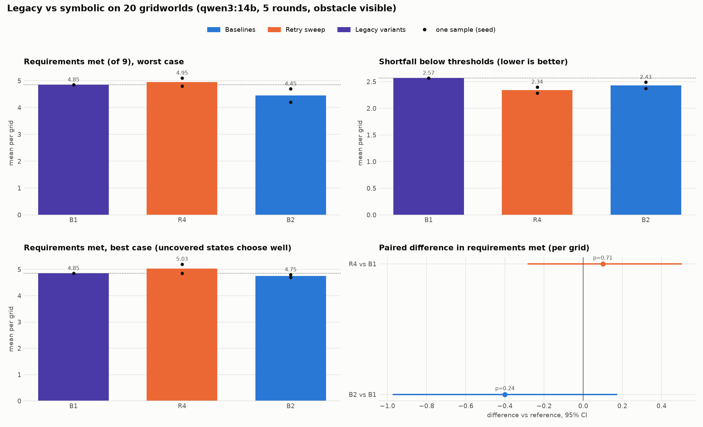
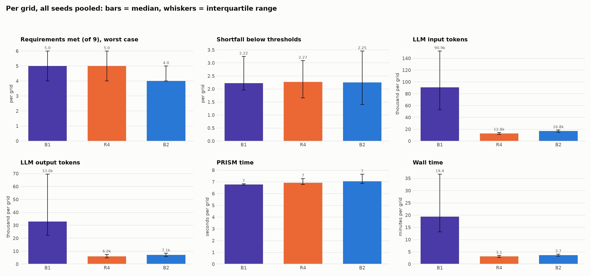
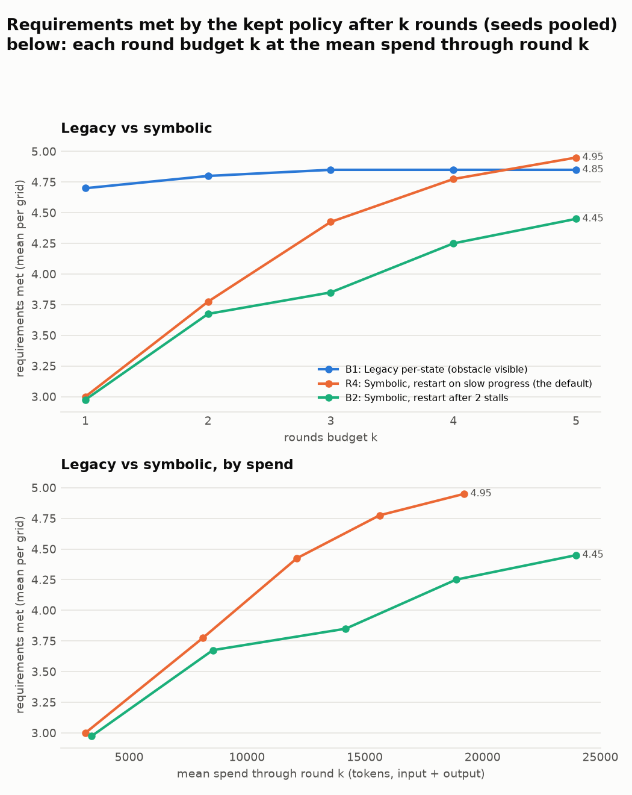
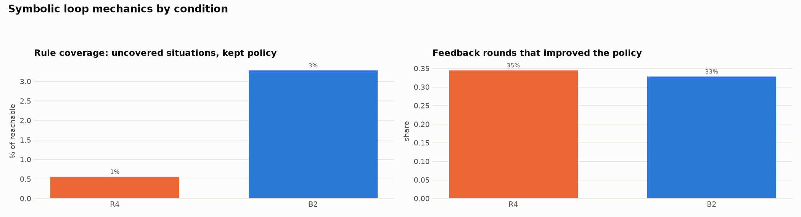

# Legacy per-state planner vs the symbolic loop (qwen3:14b) (auto-generated 2026-10-08 08:36)

Gridworld, 20 grids (19 solvable), qwen3:14b, 5 rounds, obstacle phase visible to rules and legacy. Legacy has one seed (preliminary; a second seed was not run), the symbolic conditions two. Symbolic numbers are worst case; legacy's policy is deterministic, so its best and worst case coincide. The paired tests (each symbolic condition against legacy, per grid) are exploratory, not pre-registered. Legacy logs only per-run token totals, so it has no spend curve: its whole run averages about 151k tokens per grid, 8x the default loop.

Regenerate: `python viz/ablation_summary.py configs/plot/legacy_qwen.yaml`.

## Overview

## Distributions and costs (medians, interquartile range)

## Budget curves

## Loop mechanics (symbolic)

## Outcomes (per grid, seeds pooled)

| cond | change | seeds | solved (of solvable) | req. met: mean (seed range) | median [IQR] | best case | shortfall: median [IQR] | uncovered % | vs | Δ met [95% CI] | p | feedback rounds improved |
|---|---|---|---|---|---|---|---|---|---|---|---|---|
| B1 | Legacy per-state (obstacle visible) | 1 | 0/19 | 4.85 (4.85 to 4.85) | 5 [4 to 6] | 4.85 | 2.22 [1.96 to 3.25] | 0 |  |  |  |  |
| R4 | Symbolic, restart on slow progress (the default) | 2 | 0/19 | 4.95 (4.80 to 5.10) | 5 [4 to 6] | 5.03 | 2.27 [1.66 to 3.09] | 1 | B1 | +0.10 [-0.28, +0.50] | 0.712 | 35% |
| B2 | Symbolic, restart after 2 stalls | 2 | 0/19 | 4.45 (4.20 to 4.70) | 4 [4 to 5] | 4.75 | 2.25 [1.40 to 3.46] | 3 | B1 | -0.40 [-0.97, +0.17] | 0.237 | 33% |

## Costs (mean per grid)

| cond | input tokens | output tokens | PRISM time (s) | wall time (min) | spend (tokens, input + output) |
|---|---|---|---|---|---|
| B1 | 101.5k | 50.0k | 8 | 25.7 | 151,490 |
| R4 | 13.0k | 6.2k | 9 | 3.2 | 19,219 |
| B2 | 17.0k | 7.0k | 9 | 3.7 | 23,969 |

## Requirements met after k rounds

| cond | k=1 | k=2 | k=3 | k=4 | k=5 |
|---|---|---|---|---|---|
| B1 | 4.70 | 4.80 | 4.85 | 4.85 | 4.85 |
| R4 | 3.00 | 3.77 | 4.42 | 4.78 | 4.95 |
| B2 | 2.98 | 3.67 | 3.85 | 4.25 | 4.45 |

