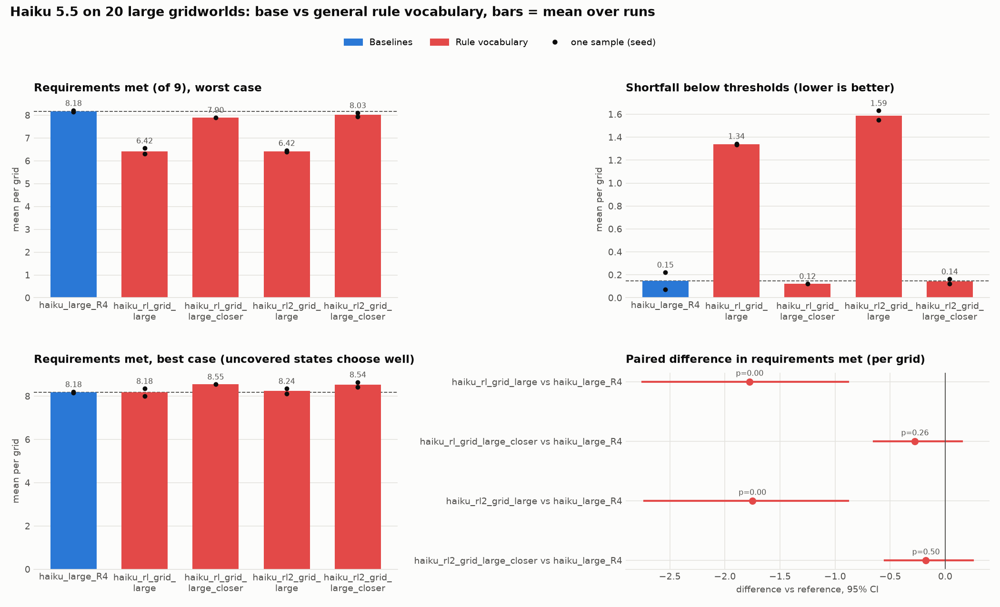
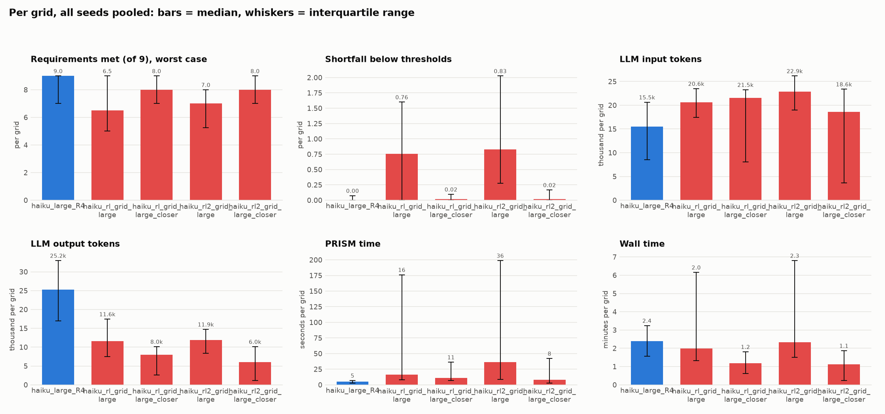
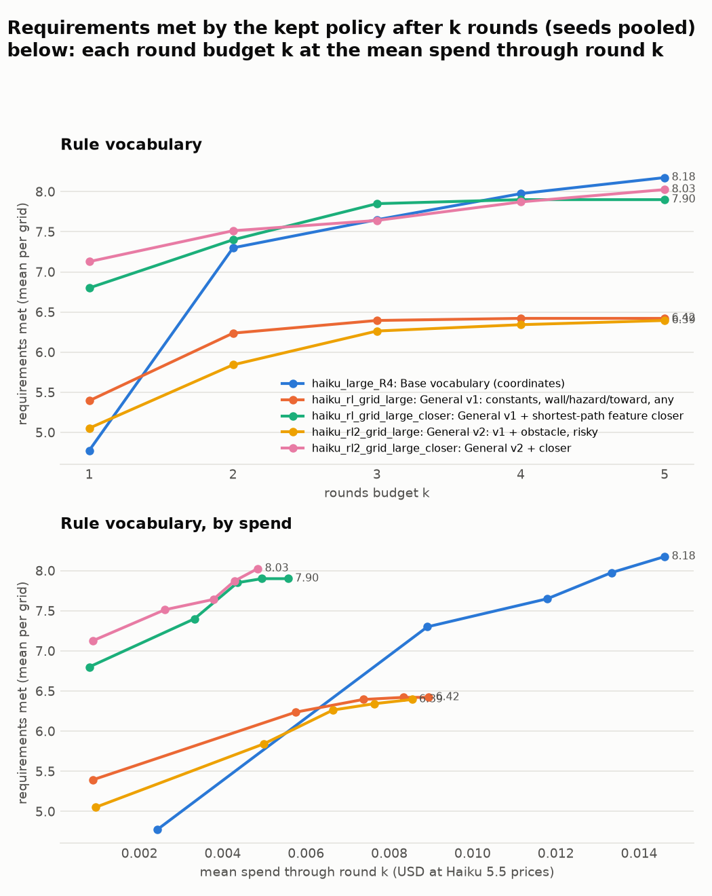
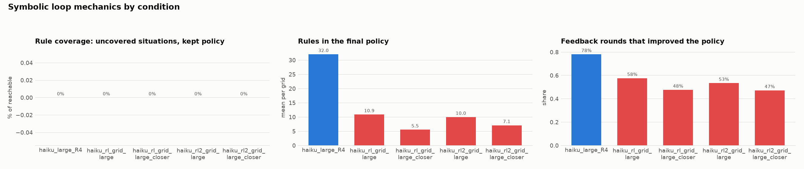

# Rule language on grid_20_large (Haiku 5.5) (auto-generated 2026-10-08 20:55)

Gridworld, 20 grids of sizes 9 to 13 (20 solvable), anthropic/claude-haiku-5.5, thinking on, restart on slow progress, obstacle phase visible. Two unseeded runs per condition, except v1 + closer (one); the paired tests are exploratory. General vocabulary: instance constants (grid size, goal coordinates), per-action features (v1: wall, hazard, toward; v2 adds obstacle and risky; closer where named), rules with action `any`, and no numbers but 0 and 1. In the first runs, five grids (v1: 14, 18; v2: 9, 19; v2 + closer: 19) ended with an error because a PRISM timeout did not take effect (fixed since; DECISIONS.md): they count as unsolved there and are left out of that run's means. The second runs, made with the fix, have no errors.

Regenerate: `python viz/ablation_summary.py configs/plot/rule_language_grid.yaml`.

## Overview

## Distributions and costs (medians, interquartile range)

## Budget curves

## Loop mechanics (symbolic)

## Outcomes (per grid, seeds pooled)

| cond | change | seeds | solved (of solvable) | req. met: mean (seed range) | median [IQR] | best case | shortfall: median [IQR] | uncovered % | vs | Δ met [95% CI] | p | feedback rounds improved |
|---|---|---|---|---|---|---|---|---|---|---|---|---|
| haiku_large_R4 | Base vocabulary (coordinates) | 2 | 12/20 | 8.18 (8.15 to 8.20) | 9 [7 to 9] | 8.18 | 0.00 [0.00 to 0.07] | 0 |  |  |  | 78% |
| haiku_rl_grid_large | General v1: constants, wall/hazard/toward, any | 2 | 5.5/20 | 6.42 (6.30 to 6.56) | 6 [5 to 9] | 8.18 | 0.76 [0.00 to 1.60] | 0 | haiku_large_R4 | -1.77 [-2.75, -0.88] | 0.001 | 58% |
| haiku_rl_grid_large_closer | General v1 + shortest-path feature closer | 1 | 9/20 | 7.90 (7.90 to 7.90) | 8 [7 to 9] | 8.55 | 0.02 [0.00 to 0.10] | 0 | haiku_large_R4 | -0.28 [-0.65, +0.15] | 0.255 | 48% |
| haiku_rl2_grid_large | General v2: v1 + obstacle, risky | 2 | 3.5/20 | 6.42 (6.39 to 6.45) | 7 [5 to 8] | 8.24 | 0.83 [0.28 to 2.03] | 0 | haiku_large_R4 | -1.75 [-2.73, -0.88] | 0.001 | 53% |
| haiku_rl2_grid_large_closer | General v2 + closer | 2 | 9.5/20 | 8.03 (7.95 to 8.10) | 8 [7 to 9] | 8.54 | 0.02 [0.00 to 0.17] | 0 | haiku_large_R4 | -0.17 [-0.55, +0.25] | 0.495 | 47% |

## Costs (mean per grid)

| cond | input tokens | output tokens | PRISM time (s) | wall time (min) | rules (final policy) | spend (USD at Haiku 5.5 prices) |
|---|---|---|---|---|---|---|
| haiku_large_R4 | 16.3k | 26.0k | 8 | 2.8 | 32.0 | 0.0146 |
| haiku_rl_grid_large | 20.4k | 13.8k | 171 | 4.8 | 10.9 | 0.00895 |
| haiku_rl_grid_large_closer | 17.0k | 7.7k | 79 | 2.3 | 5.5 | 0.00557 |
| haiku_rl2_grid_large | 21.9k | 12.7k | 217 | 5.7 | 10.0 | 0.00854 |
| haiku_rl2_grid_large_closer | 15.1k | 6.7k | 70 | 1.9 | 7.1 | 0.00484 |

## Requirements met after k rounds

| cond | k=1 | k=2 | k=3 | k=4 | k=5 |
|---|---|---|---|---|---|
| haiku_large_R4 | 4.78 | 7.30 | 7.65 | 7.97 | 8.18 |
| haiku_rl_grid_large | 5.39 | 6.24 | 6.39 | 6.42 | 6.42 |
| haiku_rl_grid_large_closer | 6.80 | 7.40 | 7.85 | 7.90 | 7.90 |
| haiku_rl2_grid_large | 5.05 | 5.84 | 6.26 | 6.34 | 6.39 |
| haiku_rl2_grid_large_closer | 7.13 | 7.51 | 7.64 | 7.87 | 8.03 |

