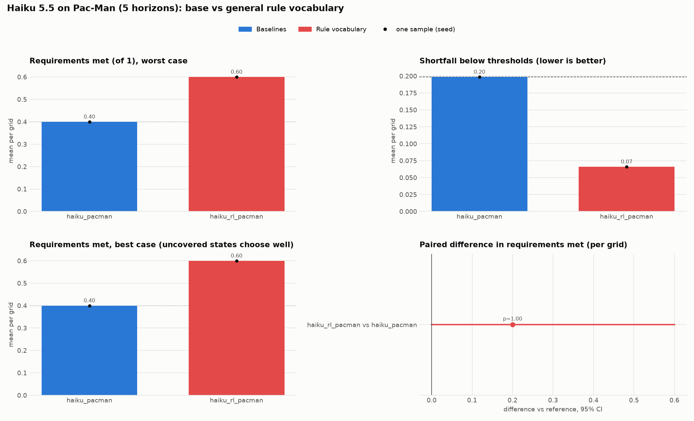
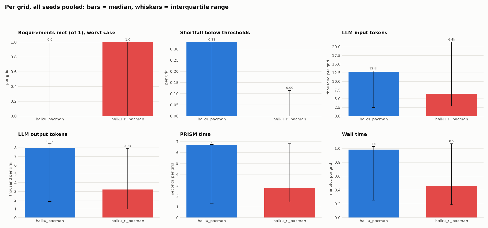
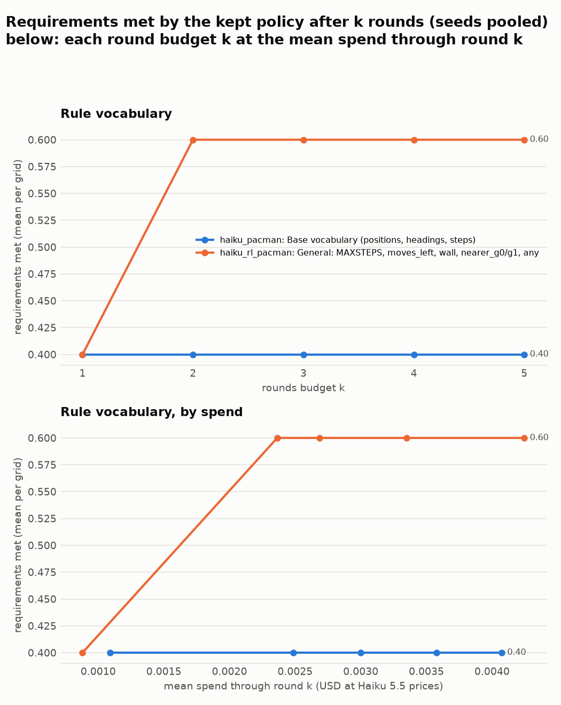
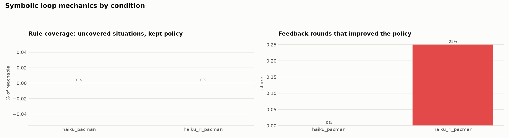

# Rule language on Pac-Man (Haiku 5.5) (auto-generated 2026-10-08 08:01)

Pac-Man (QVBS), horizons 8 to 16, crash probability <= 0.56 (optimum 0.5511), anthropic/claude-haiku-5.5, thinking on, restart on slow progress. One unseeded run per condition, so the comparison is exploratory. "Requirements met" is 0 or 1 here.

Regenerate: `python viz/ablation_summary.py configs/plot/rule_language_pacman.yaml`.

## Overview

## Distributions and costs (medians, interquartile range)

## Budget curves

## Loop mechanics (symbolic)

## Outcomes (per grid, seeds pooled)

| cond | change | seeds | solved (of solvable) | req. met: mean (seed range) | median [IQR] | best case | shortfall: median [IQR] | uncovered % | vs | Δ met [95% CI] | p | feedback rounds improved |
|---|---|---|---|---|---|---|---|---|---|---|---|---|
| haiku_pacman | Base vocabulary (positions, headings, steps) | 1 | 2/5 | 0.40 (0.40 to 0.40) | 0 [0 to 1] | 0.40 | 0.33 [0.00 to 0.33] | 0 |  |  |  | 0% |
| haiku_rl_pacman | General: MAXSTEPS, moves_left, wall, nearer_g0/g1, any | 1 | 3/5 | 0.60 (0.60 to 0.60) | 1 [0 to 1] | 0.60 | 0.00 [0.00 to 0.11] | 0 | haiku_pacman | +0.20 [+0.00, +0.60] | 1.000 | 25% |

## Costs (mean per grid)

| cond | input tokens | output tokens | PRISM time (s) | wall time (min) | spend (USD at Haiku 5.5 prices) |
|---|---|---|---|---|---|
| haiku_pacman | 8.8k | 6.4k | 5 | 0.7 | 0.00407 |
| haiku_rl_pacman | 13.4k | 5.8k | 4 | 0.8 | 0.00425 |

## Requirements met after k rounds

| cond | k=1 | k=2 | k=3 | k=4 | k=5 |
|---|---|---|---|---|---|
| haiku_pacman | 0.40 | 0.40 | 0.40 | 0.40 | 0.40 |
| haiku_rl_pacman | 0.40 | 0.60 | 0.60 | 0.60 | 0.60 |

