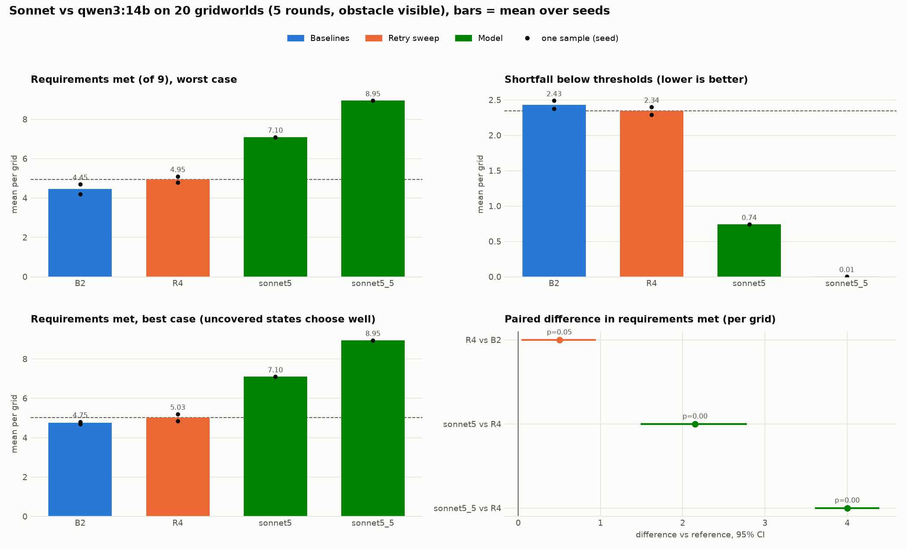
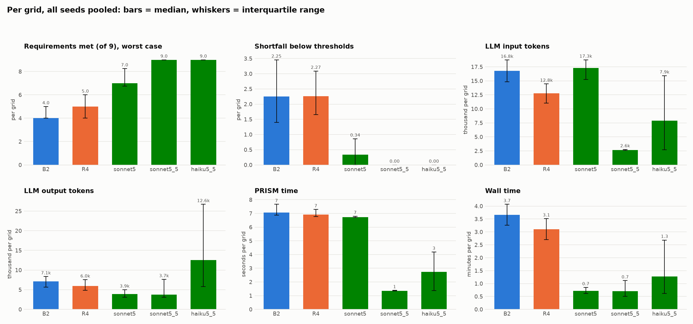
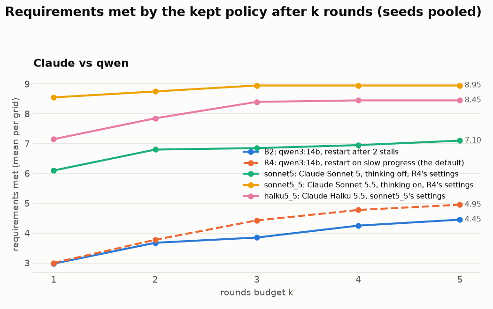
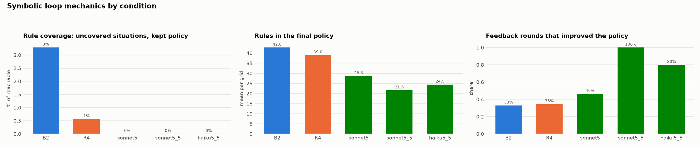

# Claude vs qwen (auto-generated 2026-10-08 09:20)

Gridworld, 20 grids (19 solvable), 5 rounds, obstacle phase visible to the rules. Models: qwen3:14b / anthropic/claude-sonnet-5 / anthropic/claude-sonnet-5.5 / anthropic/claude-haiku-5.5. The qwen conditions have 2 seeds each (local Ollama, q4_K_M, thinking off). Each Claude condition is one unseeded run on OpenRouter, Anthropic's endpoint (no Claude endpoint accepts a seed): Sonnet 5 with thinking off, Sonnet 5.5 with thinking on (its endpoints refuse to turn it off) and a 16k output cap, Haiku 5.5 with Sonnet 5.5's settings. Symbolic numbers are worst case; the Claude runs report the exact check's values (interval iteration), the qwen runs the loop's. Paired tests compare per-grid means against R4 with a sign-flip permutation test; with one Claude run per grid, treat p > 0.05 as noise.

Regenerate: `python viz/ablation_summary.py configs/plot/sonnet_vs_qwen.yaml`.

## Overview

## Distributions and costs (medians, interquartile range)

## Budget curves

## Loop mechanics (symbolic)

## Outcomes (per grid, seeds pooled)

| cond | change | seeds | solved (of solvable) | req. met: mean (seed range) | median [IQR] | best case | shortfall: median [IQR] | uncovered % | vs | Δ met [95% CI] | p | feedback rounds improved |
|---|---|---|---|---|---|---|---|---|---|---|---|---|
| B2 | qwen3:14b, restart after 2 stalls | 2 | 0/19 | 4.45 (4.20 to 4.70) | 4 [4 to 5] | 4.75 | 2.25 [1.40 to 3.46] | 3 |  |  |  | 33% |
| R4 | qwen3:14b, restart on slow progress (the default) | 2 | 0/19 | 4.95 (4.80 to 5.10) | 5 [4 to 6] | 5.03 | 2.27 [1.66 to 3.09] | 1 | B2 | +0.50 [+0.05, +0.93] | 0.055 | 35% |
| sonnet5 | Claude Sonnet 5, thinking off, R4's settings | 1 | 5/19 | 7.10 (7.10 to 7.10) | 7 [7 to 8] | 7.10 | 0.34 [0.00 to 0.86] | 0 | R4 | +2.15 [+1.50, +2.77] | 0.000 | 46% |
| sonnet5_5 | Claude Sonnet 5.5, thinking on, R4's settings | 1 | 19/19 | 8.95 (8.95 to 8.95) | 9 [9 to 9] | 8.95 | 0.00 [0.00 to 0.00] | 0 | R4 | +4.00 [+3.62, +4.38] | 0.000 | 100% |
| haiku5_5 | Claude Haiku 5.5, sonnet5_5's settings | 1 | 16/19 | 8.45 (8.45 to 8.45) | 9 [9 to 9] | 8.45 | 0.00 [0.00 to 0.00] | 0 | R4 | +3.50 [+2.83, +4.08] | 0.000 | 80% |

## Costs (mean per grid)

| cond | input tokens | output tokens | PRISM time (s) | wall time (min) | rules (final policy) |
|---|---|---|---|---|---|
| B2 | 17.0k | 7.0k | 9 | 3.7 | 42.8 |
| R4 | 13.0k | 6.2k | 9 | 3.2 | 39.0 |
| sonnet5 | 15.2k | 3.8k | 8 | 0.7 | 28.6 |
| sonnet5_5 | 4.5k | 5.9k | 2 | 1.0 | 21.6 |
| haiku5_5 | 10.5k | 18.2k | 3 | 1.8 | 24.5 |

## Requirements met after k rounds

| cond | k=1 | k=2 | k=3 | k=4 | k=5 |
|---|---|---|---|---|---|
| B2 | 2.98 | 3.67 | 3.85 | 4.25 | 4.45 |
| R4 | 3.00 | 3.77 | 4.42 | 4.78 | 4.95 |
| sonnet5 | 6.10 | 6.80 | 6.85 | 6.95 | 7.10 |
| sonnet5_5 | 8.55 | 8.75 | 8.95 | 8.95 | 8.95 |
| haiku5_5 | 7.15 | 7.85 | 8.40 | 8.45 | 8.45 |

