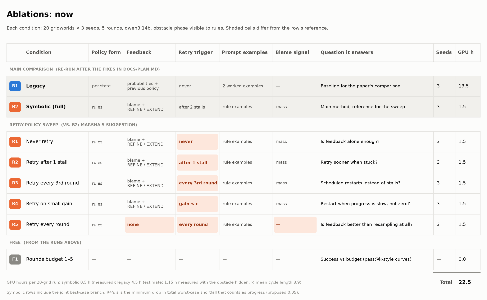
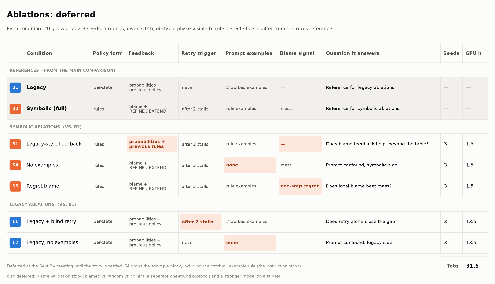

# Ablations

The figures are generated by `PRISM-Guided-Learning/viz/plot_ablation_grid.py`; edit its tables, not the PNGs.

- **Now:** `ablation_now.png`. This is the main comparison (B1, B2) plus the retry-policy sweep Marsha asked for (R1–R5). F1 comes free from these runs.
- **Deferred:** `ablation_deferred.png`. These are the factor ablations (S1, S4, S5, L1, L2), deferred at the Sept 24 meeting until the story is settled.

## Shared setup
- `grid_20_balanced`, 3 seeds, 5 rounds, qwen3:14b q4_K_M (thinking off), 2 workers, runs one after another (never concurrently).
- The obstacle phase is visible to rules in **every** condition, legacy included.
- Every symbolic condition has the joint best-case branch. Nothing runs until all of `docs/plan.md` Phase A is in, so no condition has to be re-run for a code tweak.

## Conditions
| id | change from its reference |
|---|---|
| R1 | Never start over from the initial prompt (`retry=never`). |
| R2 | Start over after **1** round without improvement (B2 uses 2). |
| R3 | Start over at rounds 4, 7, … (every 3rd round after the first), whatever the progress. |
| R4 | Start over when the kept policy's total worst-case shortfall improved by less than ε = 0.05 in the last round. |
| R5 | Every round is a fresh initial prompt, with no feedback (pure resampling, keep-best). |
| S1 | Feedback is the probability table plus the previous rules. No blame and no REFINE/EXTEND framing. |
| S4 | No example block in the prompt. This also drops the catch-all example rule; the instruction stays. |
| S5 | Blame by one-step regret (`max_a Q(s,a) − Q(s,π(s))` on the best-case values) instead of mass. |
| L1 | Legacy with B2's blind retry (after 2 stalls). |
| L2 | Legacy without its two worked examples. |
| F1 | No runs. The result with budget k = the kept policy after the first k rounds, because nothing in rounds 1..k depends on later rounds. This gives success vs budget for k = 1..5 from every run above. |

## Running and storage
- `src/run_ablation.py <condition> --seeds 1 2 3`: a named registry of conditions, each a config override of the planner or legacy runner. B1 and B2 run through the same entry point.
- Outputs: `out/results/ablations/<condition>/seed_<k>/` (same parquet and `outputs/` layout as other runs, plus a `config.json` recording the full settings).
- Analysis: medians and spread over grids × seeds, paired comparisons per grid against the reference, and F1 curves. Plots go through `viz/plot_runs.py` (to be extended to read the ablation layout).
