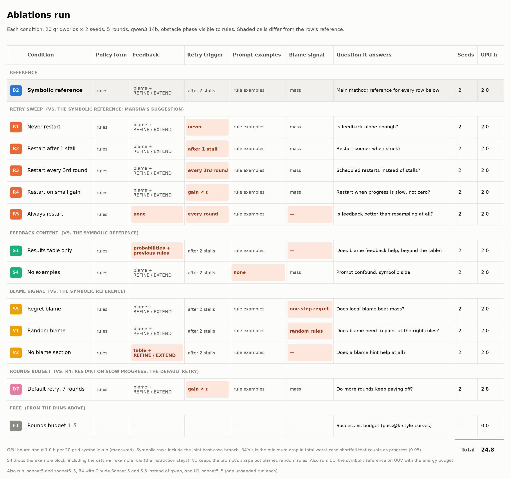
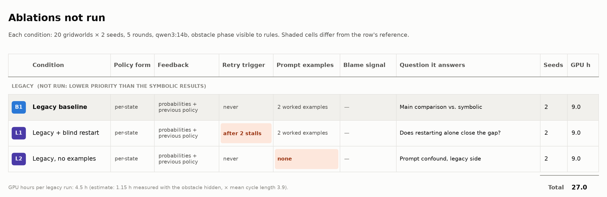

# Ablations

The figures are generated by `PRISM-Guided-Learning/viz/plot_ablation_grid.py configs/plot/ablation_grid.yaml`; edit its tables, not the PNGs.

- **Run:** `ablation_run.png`. The symbolic reference (B2), the retry sweep Marsha asked for (R1–R5), feedback content (S1, S4) and blame signal (S5, V1, V2) and the rounds budget (D7), 2 seeds each, plus U1 (UUV with the energy budget) and sonnet5 / sonnet5_5 (R4 with Claude Sonnet 5 and 5.5, one run each). F1 comes free from these runs.
- **Not run:** `ablation_not_run.png`. The legacy baseline (B1) and its variants (L1, L2), lower priority than the symbolic results.
- **Results:** `PRISM-Guided-Learning/out/results/ablations/summary/SUMMARY.md` (all finished runs, figures and paired tests; rebuilt by `viz/ablation_summary.py configs/plot/ablation_summary.yaml`, which also lists each condition's family, reference and description).

## Shared setup
- `grid_20_balanced`, 2 seeds (each seed's outputs kept), 5 rounds, qwen3:14b q4_K_M (thinking off), 2 workers, runs one after another (never concurrently). Order: all symbolic conditions first, then legacy.
- The obstacle phase is visible to rules in **every** condition, legacy included.
- Every symbolic condition has the joint best-case branch.

## Conditions
| id | change from its reference |
|---|---|
| R1 | Never start over from the initial prompt (`retry=never`). |
| R2 | Start over after **1** round without improvement (B2 uses 2). |
| R3 | Start over at rounds 4, 7, … (every 3rd round after the first), whatever the progress. |
| R4 | Start over when the kept policy's total worst-case shortfall improved by less than ε = 0.05 in the last round. |
| R5 | Every round is a fresh initial prompt, with no feedback (pure resampling, keep-best). |
| S1 | Feedback is the probability table plus the previous rules. No blame and no REFINE/EXTEND framing. |
| S4 | No example block in the prompt. This also drops the catch-all example rule; the instruction stays. |
| S5 | Blame by one-step regret (`max_a Q(s,a) − Q(s,π(s))` on the best-case values, Q on the bare MDP; successors the policy never reaches take their optimum value) instead of mass. Extend hotspots: the local gap best(s) − worst(s), no occupancy. The prompt describes the signal as regret / local gap. |
| V1 | Blame on **random** rules and states (same number as B2 shows, equal shares, seeded). The prompt keeps B2's wording, so this is a placebo for "the blame points at the right rules". |
| V2 | No blame section; REFINE/EXTEND framing and the results table stay. Compare with S1 (no framing either). |
| L1 | Legacy with B2's blind retry: after 2 rounds without improvement, the next round uses the initial prompt (per goal and phase). |
| L2 | Legacy without its two worked examples (the short action examples in the repair prompt stay). |
| D7 | The default retry (restart on slow progress, as R4) with 7 rounds instead of 5. Its first 5 rounds use the same per-call seeds as R4, so it also checks the run-to-run reproducibility of R4. |
| U1 | Not an ablation: the symbolic reference (B2's settings) on UUV (both scenarios, energy budget included, mass horizon = mission deadline). |
| sonnet5 | R4 with Claude Sonnet 5 instead of qwen (OpenRouter, Anthropic's endpoint), thinking off as for qwen. One unseeded run (`seed_none`): no Sonnet endpoint accepts a seed. |
| sonnet5_5 | R4 with Claude Sonnet 5.5, thinking on (its endpoints refuse to turn it off) and a 16k output cap, since the cap covers thinking and answer. One unseeded run. |
| U1_sonnet5_5 | U1 with Sonnet 5.5's model settings (UUV, both scenarios). One unseeded run. |
| F1 | No runs. The result with budget k = the kept policy after the first k rounds, because nothing in rounds 1..k depends on later rounds. This gives success vs budget for k = 1..5 from every run above. |

## Running and storage
- `src/run_ablation.py <condition> …` (seeds from `configs/ablation/default.yaml`, or `--seeds`; add `--dry-run` to check first): each condition is a file `configs/run/conditions/<name>.yaml` (see `docs/config.md`), an override of `configs/run/default.yaml`. B1 and B2 run through the same entry point. Finished runs are skipped, so an interrupted batch resumes with the same command.
- Every condition above is implemented. B2's prompts don't depend on the batch-2 settings (checked with a scripted LLM on the refine and extend paths), so batch-1 and batch-2 runs are comparable.
- Outputs: `out/results/ablations/<condition>/seed_<k>/` (same parquet and `outputs/` layout as other runs, plus a `config.json` recording the full settings).
- Analysis: `viz/ablation_summary.py configs/plot/ablation_summary.yaml` rebuilds `out/results/ablations/summary/` (SUMMARY.md, conditions/budget/mechanics figures, paired sign-flip tests per grid against each condition's reference). `configs/plot/sonnet_vs_qwen.yaml` puts the Sonnet conditions against R4 and B2 in `out/results/sonnet_vs_qwen/`. Also `src/compare.py` (one legacy vs one symbolic run, ceiling-aware) and `viz/plot_budget.py`.
